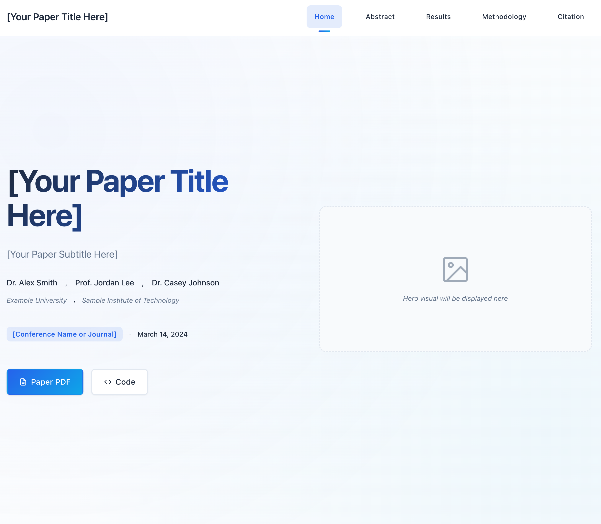

# Academic Paper Website

A responsive, single-page website template for showcasing academic research papers. Built with modern web technologies and optimized for GitHub Pages deployment.



## Features

- **Responsive Design**: Mobile-first approach that works on all devices
- **Academic Focus**: Structured sections for abstract, results, methodology, and citations
- **Performance Optimized**: Fast loading with optimized images and assets
- **SEO Ready**: Includes meta tags, Open Graph, and Schema.org markup
- **Accessibility**: WCAG compliant with proper semantic HTML
- **Easy to Customize**: Clear structure and well-commented code

## Project Structure

```
ghostfaces-website/
├── assets/
│   ├── css/
│   │   └── style.css          # Main stylesheet
│   ├── js/
│   │   └── main.js           # Main JavaScript file
│   └── images/
│       └── placeholder-*.jpg  # Sample images
├── data/
│   ├── paper-info.json       # Paper metadata
│   ├── results-gallery.json  # Results gallery data
│   └── methodology.json      # Methodology sections data
├── index.html                # Main HTML file
├── robots.txt               # Search engine directives
├── sitemap.xml             # XML sitemap
└── .nojekyll              # Bypass Jekyll processing

```

## Quick Start

### 1. Fork or Clone the Repository

```bash
git clone https://github.com/yourusername/ghostfaces-website.git
cd ghostfaces-website
```

### 2. Customize Your Content

Edit the JSON files in the `data/` directory:

- **`paper-info.json`**: Update paper title, authors, abstract, and publication details
- **`results-gallery.json`**: Add your research results and images
- **`methodology.json`**: Describe your methodology sections

### 3. Replace Images

Replace the placeholder images in `assets/images/` with your own:
- Use descriptive filenames
- Optimize images for web (recommended: max 1920px width)
- Update image references in the JSON files

### 4. Update Metadata

In `index.html`, update:
- Meta tags (description, keywords, author)
- Open Graph tags for social media
- Schema.org structured data
- Canonical URL

## Deployment to GitHub Pages

### Option 1: Using GitHub Actions (Recommended)

1. Push your code to a GitHub repository
2. Go to Settings → Pages
3. Under "Source", select "GitHub Actions"
4. Push to main branch - the site will deploy automatically

### Option 2: Deploy from Branch

1. Push your code to a GitHub repository
2. Go to Settings → Pages
3. Under "Source", select "Deploy from a branch"
4. Choose "main" branch and "/ (root)" folder
5. Click Save

Your site will be available at: `https://[username].github.io/[repository-name]/`

## Local Development

To test locally, use any static server:

```bash
# Using Python
python3 -m http.server 8000

# Using Node.js
npx http-server

# Using PHP
php -S localhost:8000
```

Then visit `http://localhost:8000`

## Customization Guide

### Styling

- Edit `assets/css/style.css` for custom styles
- CSS variables are defined in `:root` for easy theming
- Responsive breakpoints: 640px, 768px, 1024px

### JavaScript

- Main functionality in `assets/js/main.js`
- Includes smooth scrolling, navigation, and gallery features
- Add custom scripts as needed

### Adding Sections

1. Add HTML structure in `index.html`
2. Style in `assets/css/style.css`
3. Add functionality in `assets/js/main.js`
4. Update navigation menu

## Browser Support

- Chrome (latest)
- Firefox (latest)
- Safari (latest)
- Edge (latest)
- Mobile browsers

## Performance Tips

1. **Images**: Use WebP format with JPEG fallbacks
2. **Fonts**: Use system fonts or limit web font weights
3. **CSS**: Keep critical CSS inline, defer non-critical
4. **JavaScript**: Load scripts with `defer` attribute

## Acknowledgements

This website template was built upon the excellent work from:

- [Nerfies](https://github.com/nerfies/nerfies.github.io) - Template structure and design patterns
- [Make-A-Video](https://makeavideo.studio/) - Website layout and presentation concepts

## License

This project is open source and available under the MIT License.